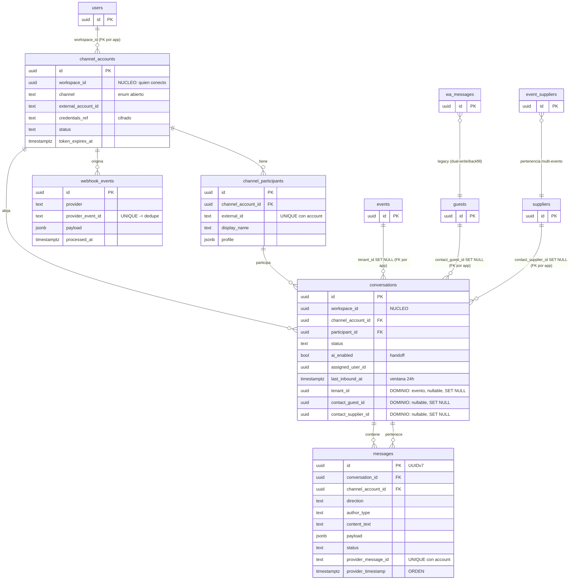

# Nucleo omnicanal Anfiora — Diseno (el "plano")

**Fecha:** 2026-06-24
**Estado:** spec aprobada en brainstorming, lista para plan de implementacion
**Objetivo doble:** (1) un inbox omnicanal real dentro de Anfiora; (2) un nucleo
agnostico tan limpio que se pueda **copiar verbatim** a otra app (ventas / tiendas
online) en otro lenguaje, donde solo se reescribe la capa de dominio.

> Este documento es el plano. Los dos archivos SQL hermanos (`core.sql`,
> `anfiora.sql`) son la fuente de verdad del esquema. Esto los narra y agrega los
> contratos de adaptadores, la coexistencia con WhatsApp y el diagrama.

---

## 1. Principio rector: ports & adapters (hexagonal)

Todo canal entra y sale por un **adaptador**. El nucleo nunca ve un payload nativo
de Twilio/Meta/Telegram: solo ve un **mensaje canonico**. La salida es igual al
reves. Asi, agregar TikTok manana = agregar un adaptador, **cero cambios al nucleo**.

```
WhatsApp/Twilio ─┐                                  ┌─> WhatsApp/Twilio
Instagram/Meta  ─┤                                  ├─> Instagram/Meta
Facebook/Meta   ─┼─> [ADAPTADOR IN] ─> NUCLEO ─> [ADAPTADOR OUT] ─┤
Telegram        ─┤      (normaliza)   (agnostico)    (traduce)    ├─> Telegram
TikTok / ...    ─┘                                  └─> TikTok / ...
```

### Las 6 piezas

| # | Pieza | Responsabilidad | Lado |
|---|-------|-----------------|------|
| 1 | **Adaptadores IN** | payload nativo -> `InboundMessage` canonico | nucleo (1 por canal) |
| 2 | **Normalizador / Store** | upsert de participante + conversacion + mensaje canonico; dedupe; orden | nucleo |
| 3 | **Router de tenant** | decide a que evento/contacto pertenece (regla A); reasignable | **dominio** |
| 4 | **Cerebro IA** | conversa + usa herramientas; lee grounding/memoria del dominio | nucleo (orquesta) + dominio (tools) |
| 5 | **Adaptadores OUT** | `OutboundMessage` canonico -> API nativo del canal | nucleo (1 por canal) |
| 6 | **Inbox (UI)** | bandeja unica con badge de canal + panel de contacto | dominio (consume el nucleo) |

La frontera clave: **el nucleo solo sabe de mensajeria + workspace.** Quien es esa
persona en tu negocio (invitado, proveedor, prospecto), a que evento pertenece, y
que sabe/puede el cerebro, es **dominio**.

---

## 2. Modelo de datos (consolidado)

5 tablas de nucleo en v1: `channel_accounts`, `channel_participants`,
`conversations`, `messages`, `webhook_events`. `message_status` y
`message_attachments` se promueven a tablas propias en **v1.1** (ver seccion 7).

### La frontera nucleo <-> dominio

- **`core.sql`** declara columnas, no constraints de dominio. Lo unico "de negocio"
  que vive ahi es **`workspace_id`** (quien conecto la integracion) — intrinseco a
  la mensajeria y lo que hace al nucleo asegurable por si solo via RLS.
- **`anfiora.sql`** agrega encima: los FK reales (`tenant_id -> events`,
  `contact_guest_id -> guests`, `contact_supplier_id -> suppliers`,
  `workspace_id/assigned_user_id/author_user_id -> users`), el CHECK, los indices
  de dominio y las politicas RLS.

Esto da el **embedding de PostgREST gratis** (`select=*,guests(*)`) sin perder
integridad referencial, y permite copiar `core.sql` a la app de ventas tal cual.

### Tres decisiones criticas grabadas en el esquema

1. **Dos niveles de tenancy.** `channel_account` pertenece al **workspace/usuario**
   (un numero sirve a muchos eventos). `conversation` apunta al **evento**
   (`tenant_id`) por logica, no por herencia. El numero NO se reparte por evento.

2. **Vinculo de contacto = maximo uno, ambos NULL permitido.**
   `check (not (contact_guest_id is not null and contact_supplier_id is not null))`.
   Invitado **o** proveedor **o** ninguno (prospecto/spam sin clasificar). Nunca los
   dos.

3. **Nada se borra por dominio: todo es `ON DELETE SET NULL`.** Borrar un
   evento/invitado/proveedor **desvincula** el hilo (cae al inbox general) pero
   jamas destruye su historial. Un hilo de proveedor sirve a varios eventos; un
   CASCADE aqui seria perdida de datos. La pertenencia proveedor<->evento se decide
   por **`event_suppliers`** (muchos-a-muchos, persistente), **no** por `tenant_id`.

### Handoff y ventana 24h (en `conversations`)

- **`ai_enabled`** (separado de `status`): cuando un humano toma la conversacion,
  el cerebro se calla. Es la reubicacion de `guests.wa_needs_human` (invertido).
- **`assigned_user_id`**: quien la atiende.
- **`last_inbound_at`**: para saber si se puede mandar texto libre (dentro de 24h)
  o solo plantilla aprobada (WhatsApp/Meta).

### Idempotencia y orden

- **Dedupe 2 capas:** `webhook_events UNIQUE(provider, provider_event_id)` con
  `ON CONFLICT DO NOTHING` (primera linea) + `messages UNIQUE(channel_account_id,
  provider_message_id)` (red de seguridad canonica).
- **Orden por `provider_timestamp`**, nunca por orden de llegada. PK UUIDv7 para
  salud del indice y desempate, **no** para ordenar display.

---

## 3. Inbox general vs por evento (una tabla, dos filtros)

- **Inbox general** = `conversations WHERE workspace_id = <planner>` (todos los
  canales, todos los eventos, mas las sin clasificar). Es el inbox del wedding
  planner que pediste.
- **Inbox por evento** = la misma consulta filtrada por `tenant_id = <evento>`
  (invitados) **union** proveedores ligados a ese evento via `event_suppliers`.

El inbox por evento que ya te gusta no desaparece: se vuelve una **vista filtrada**
del general. El chat nunca estuvo duplicado.

### Router de tenant (regla A)

Cuando llega un mensaje de un numero que es invitado en >1 evento del mismo planner,
se asigna al **evento activo mas proximo en fecha**. Es solo una **sugerencia**: el
inbox general es la red de seguridad y el hilo es **reasignable** a otro evento desde
la UI. Si no matchea ningun invitado, queda **sin clasificar** en el general.

### Seguridad de dos niveles (RLS)

- **Dueno del workspace** -> ve el inbox general completo (`workspace_id = auth.uid()`).
- **Colaborador de un evento** -> ve solo conversaciones de su evento (invitados por
  `tenant_id` + proveedores por `event_suppliers`).
- **Sin clasificar** -> solo el dueno.

---

## 4. Contratos de adaptadores

Cada adaptador IN produce un `InboundMessage` canonico:

```
InboundMessage {
  channel, external_account_id,           -- a que channel_account
  participant_external_id, display_name, profile,
  provider_message_id, provider_timestamp,
  content_text, payload, attachments[]
}
```

Cada adaptador OUT consume un `OutboundMessage` canonico y llama al API nativo.

| Canal | provider_message_id | provider_timestamp | webhook_events.provider_event_id | Separar mensajes de status |
|-------|---------------------|--------------------|----------------------------------|----------------------------|
| **WhatsApp (Twilio)** | `MessageSid` | Twilio es pobre en inbound -> usar `received_at` como fallback | `MessageSid + ':' + (MessageStatus o 'inbound')` | Twilio **reusa el `MessageSid`** en los status callbacks. Los callbacks (`MessageStatus`) **NO crean fila en `messages`**: actualizan `messages.status` buscando por `provider_message_id`. |
| **Instagram + Facebook (Meta Graph)** | `mid` del evento | `timestamp` (ms) | basado en `mid` (`mid + ':' + tipo`) | Meta manda `messages` y `delivery/read` en la **misma** estructura de webhook -> separar por tipo de evento al parsear. IG y FB comparten shape; cambia el `object` (`instagram` vs `page`) y el `external_account_id`. |
| **Telegram (Bot API)** | `message.message_id` (por chat) | `message.date` (segundos, **grueso** -> desempatar por `update_id`) | `update_id` (unico y monotonico por bot) | Telegram **no** empuja recibos de entrega -> `status` casi N/A. `update_id` sirve para dedupe Y orden. |

**Credenciales por canal** (`channel_accounts.credentials_ref`): cifradas en reposo
(Vault/pgsodium o cifrado app-level con llave en env var — decision de
implementacion). Nunca texto plano, nunca accesibles desde el cliente, solo
`service_role`. Tokens long-lived de Meta caducan ~60d -> `token_expires_at` + job de
refresh. Twilio y Telegram son estaticos.

---

## 5. Flujo serverless (Vercel)

1. Webhook recibe -> **inserta crudo** en `webhook_events` -> responde **200**.
2. Procesa con **`after()` / `waitUntil`** (Fluid Compute): normaliza, upsert
   participante/conversacion/mensaje, dispara el cerebro.
3. **Cron sweeper** (pg_cron o Vercel Cron) drena `processed_at IS NULL` — red de
   seguridad **obligatoria** por si `after()` truena.
4. **Debounce antes del cerebro:** 3 mensajes en 5s = **1** respuesta, no 3. Se
   buferea por conversacion.

---

## 6. Coexistencia con WhatsApp (no romper produccion)

El flujo WA actual (webhook inline -> Claude -> `wa_messages` -> `guests`) **debe
seguir vivo** durante la transicion.

### Estrategia: dual-write + backfill idempotente

1. **WhatsApp se vuelve el primer adaptador del nucleo.** El webhook refactorizado
   escribe al modelo canonico **y sigue escribiendo `wa_messages`** (la UI actual ni
   se entera). Un solo camino de codigo, dos destinos durante la transicion.
2. **Backfill** `wa_messages -> conversations + messages`, re-ejecutable e idempotente
   (gracias a `UNIQUE(channel_account_id, provider_message_id)`):

   | `wa_messages` | canonico |
   |---|---|
   | `guest_id` | `contact_guest_id` (en la conversacion) |
   | `event_id` | `tenant_id` |
   | `twilio_sid` | `provider_message_id` (hoy **sin** UNIQUE -> el constraint nuevo tapa el hoyo) |
   | `author` | `author_type` |
   | `body` / `content` | `content_text` |
   | `direction` | `direction` |
   | `sent_at` / `created_at` | `provider_timestamp` / `received_at` |

3. **Handoff:** `guests.wa_needs_human = true` -> `conversations.ai_enabled = false`
   (**invertido**). Durante la transicion se **espejea**: el flujo viejo sigue
   escribiendo `wa_needs_human`, el codigo nuevo lee `ai_enabled`. `wa_needs_human_reason`
   se queda en dominio. Se corta el espejo cuando el nucleo sea fuente de verdad.

4. **Credenciales (deuda de seguridad viva):** hoy `users.wa_sender_phone`,
   `wa_phone_number_id`, `wa_waba_id`, `wa_subaccount_sid`, `wa_sender_status`,
   `wa_connected_at` estan en **texto plano**. Migracion en 3 pasos sin desconectar WA:
   (a) crear un `channel_accounts` por usuario desde esas columnas + **cifrar**;
   (b) cambiar envio/recepcion para leer de `channel_accounts`;
   (c) recien entonces **dropear** las columnas `wa_*` de `users`.

5. **Frontera del cerebro confirmada:** `agent_config` (en `event_settings`) y
   `agent_memory` (en `guests`) son **dominio**. El nucleo nunca los lee; el cerebro
   los carga del lado del dominio al construir el contexto. La memoria episodica por
   invitado sigue donde esta.

---

## 7. Fasing

- **v1 (5 tablas):** nucleo + WhatsApp como primer adaptador (dual-write + backfill).
- **v1.1:** promover `message_status` (historial de recibos) y `message_attachments`
  (re-hosting de media a Supabase Storage — las URLs de Meta caducan). **Si v1 acepta
  imagenes, el re-hosting entra en v1.**
- **v2:** Telegram (valida la abstraccion de punta a punta, sin verificacion Meta).
- **v3:** Instagram + Facebook (misma Graph API).
- **v4:** Inbox unificado (UI) con badge de canal + panel de contacto.
- **v5:** apagar el camino viejo cuando todo este estable.

---

## 8. Decisiones abiertas / riesgos

- **UUIDv7:** no nativo en Postgres < v18. Instalar `pg_uuidv7` o quedarse en
  `gen_random_uuid()` (v4) por ahora. No bloquea v1.
- **Cifrado de credenciales:** Vault (pgsodium) vs app-level con llave en env var.
  Decision de implementacion; el principio (cifrado, solo service_role) no cambia.
- **Enforcement de ventana 24h:** logica en el cerebro/outbound leyendo
  `last_inbound_at`; fuera de 24h, solo plantilla aprobada.
- **Mecanismo de debounce:** buffer por conversacion (in-memory por request no basta
  en serverless) -> probable cola corta o ventana en DB. A definir en el plan.

---

## 9. Diagrama ER (nucleo vs dominio)



**Nucleo (copiable verbatim):** `channel_accounts`, `channel_participants`,
`conversations` (sin las 3 columnas de dominio), `messages`, `webhook_events`.
**Dominio (se reescribe por app):** `events`, `guests`, `suppliers`,
`event_suppliers`, `users`, `wa_messages`, y las 3 columnas `tenant_id` /
`contact_guest_id` / `contact_supplier_id` con sus FK + RLS.
